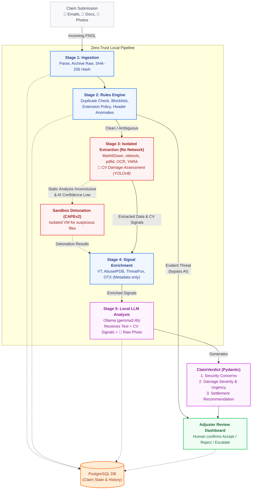

# Imani AI: The Ultimate Zero-Trust Claims Automation Data Room

**Target Sector:** Insurance & Banking  
**Theme:** Intelligent Claims Automation  

Welcome to the **Imani AI Data Room**. This document serves as the comprehensive technical deep-dive, architectural blueprint, and experimental justification for our hackathon submission. We are solving the biggest paradox in modern insurance: **You cannot automate claims intake if the automation pipeline itself is a security liability.**

When insurers automate First Notification of Loss (FNOL) emails, they blindly pull in unstructured, weaponized attachments (PDFs, Office docs, manipulated photos). This exposes internal networks to Business Email Compromise (BEC) and zero-day ransomware. **Imani AI** is our localized, air-gapped, zero-trust claims automation engine. It securely ingests claims, extracts data, assesses physical vehicle damage via Computer Vision, and summarizes the case—all while running completely on-premises. **Nothing ever pays out without a human adjuster clicking confirm.**

---

## 1. End-to-End Architecture Diagram

Below is the definitive architecture of the Imani AI pipeline. It illustrates our unique approach: blending a deterministic trust hierarchy with probabilistic AI. Static, deterministic checks run first and can *never* be overridden by the AI.

---

## 2. The 5-Stage Pipeline: Layer-by-Layer Breakdown

Our architecture is strictly segregated into 5 stages to prevent prompt injection and malware execution from ever reaching the insurance operators.

### A. Stage 1: Ingestion Layer
- **What it does:** Securely polls IMAP inboxes in the background, parsing raw `.eml` payloads. It archives the raw files and generates a `SHA-256` hash to guarantee strict idempotency. We never process the same claim twice.
- **Why it matters:** It acts as the frontline gatekeeper. By hashing the raw email immediately, we prevent replay attacks and system flooding.

### B. Stage 2: Deterministic Security (Rules Engine)
- **What it does:** Runs lightning-fast, non-AI checks. It queries our internal `blocklist` and `whitelist` databases, checks for strict extension policies (immediately dropping `.exe` or `.bat` files), and flags DKIM/SPF/DMARC anomalies.
- **Why it matters:** **AI is probabilistic; security must be deterministic.** If this stage detects an evident threat, the email is instantly bypassed from AI execution and routed directly to a human security analyst. An AI can be tricked by prompt injection, but a deterministic rules engine cannot.

### C. Stage 3: Isolated Extraction & Detonation
- **What it does:** Extracts data from unstructured attachments safely. Text is stripped from PDFs using `PyMuPDF` and from Office docs using `oletools`. Images are run through `pytesseract` for OCR and our proprietary `ultralytics` YOLOv8 model for **Computer Vision vehicle damage assessment**. 
- **The Sandbox:** If a file is ambiguous (static analysis inconclusive), it is pushed to the `pending_detonation` queue. A highly isolated CAPEv2 Virtual Machine "detonates" the file to observe behavioral threats without risking our host network.
- **Why it matters:** All extraction runs in network-less Docker containers (`--network=none`, `--read-only`). Even if a zero-day exploit breaks the PDF parser, it is trapped in an isolated container with no outbound internet access.

### D. Stage 4: Signal Enrichment
- **What it does:** Takes the extracted metadata (IPs, domains, file hashes) and queries massive threat intelligence feeds like AlienVault OTX, AbuseIPDB, VirusTotal, and ThreatFox.
- **Why it matters:** We **never** send file content (PII, medical records, ID cards) off-machine. Only non-reversible metadata leaves the perimeter, preserving 100% GDPR and local banking secrecy compliance.

### E. Stage 5: Local LLM Analysis
- **What it does:** Feeds the extracted text, the Computer Vision bounding boxes, the raw claim photos, and the enriched security signals into a highly optimized, quantized local Vision LLM (Ollama running `gemma3:4b`). The LLM outputs a strictly structured JSON payload validated by Pydantic.
- **Why it matters:** The output is broken into two strict sections: **Security Concerns** (is this fraud?) and **Verdict** (severity, urgency, and settlement recommendations). This dual-axis analysis ensures the LLM handles workflow automation while respecting the security boundaries. Additionally, we use Llama Guard 3 (`transformers`) to defend against semantic prompt injections.

---

## 3. Database Schema in Detail

Our PostgreSQL database is designed for scale, idempotency, and ISO 27001 compliance.

* **`emails`**: The core state table. Stores the `idempotency_key`, sender metadata, and the massive JSONB payloads containing the `rules_result`, `enrichment_result`, and `llm_result`.
* **`urgency`**: Drives the Adjuster Dashboard triage queue. Ranks claims from `low` to `critical` priority. Tracks whether an AI-proposed settlement (`assistive` or `automated`) was confirmed by a human.
* **`released_claims`**: **The Ultimate Gate.** Insurance Operators only read from this table. A claim *only* enters this table if a SOC Analyst/Admin has explicitly released it. Malware never reaches the insurance team's desk.
* **`audit_log`**: An immutable ledger of every system event and human action (e.g., overriding an AI verdict, quarantining a file). Logs are also written to a segregated, rotated flat-file system (`audit_secure.log`) to meet ISO 27001 log segregation requirements.
* **`users`**: Role-Based Access Control (RBAC). Passwords hashed with `bcrypt`, strict TOTP 2FA enforced via `pyotp`. Granular JSONB permissions ensure a `viewer` can't accidentally release a ransomware payload.
* **`pending_detonation`**: Asynchronous queue management for the CAPEv2 sandbox.
* **`analyst_feedback`**: When an adjuster corrects the AI, the reasoning is saved here. This creates a continuous learning loop to refine our LLM prompts and blocklists.

---

## 4. Technology Stack & Strategic Choices

We didn't just pick frameworks; we engineered a stack capable of enterprise scale on consumer-grade hardware.

| Component | Technology | Why We Chose It for the Hackathon |
| :--- | :--- | :--- |
| **Backend API** | `FastAPI` + `uvicorn` | Unmatched asynchronous throughput. Perfect for background polling and heavy concurrent HTTP requests. |
| **Database ORM** | `SQLAlchemy 2.0` | Secure connection pooling (`pool_size=5`), excellent JSONB support for our complex LLM schemas, preventing SQL injection inherently. |
| **Schema Validation** | `Pydantic v2` | LLMs hallucinate. Pydantic forces the LLM to return exactly the `ClaimVerdict` schema we demand, or it retries. |
| **Security & Auth** | `bcrypt`, `PyJWT`, `pyotp` | Zero compromises on auth. TOTP Multi-Factor Authentication is enforced on all admin accounts from minute one. |
| **Local LLM** | `Ollama` (`gemma3:4b`) | 100% local inference. 0 API costs. `gemma3` brings state-of-the-art vision capabilities on a 4B parameter footprint, running effortlessly on local hardware. |
| **Computer Vision** | `ultralytics` (YOLOv8) | The industry standard for real-time object detection. We use it to physically map and bound vehicle damage in claim photos *before* the LLM sees it. |
| **Extraction Tooling** | `markitdown`, `oletools`, `pymupdf` | Open-source, battle-tested forensic tools for safely ripping text out of potentially malicious documents. |
| **Frontend** | `Jinja2` Templates | Server-side rendering with strict Content Security Policies (CSP). We refuse to use bloated SPA frameworks (React/Vue) that open the door to client-side supply-chain attacks. |

---

## 5. Architectural Design & Experimental Justifications

Unlike many AI wrappers that blindly trust large language models, Imani AI’s architecture is the result of rigorous experimentation. We didn't guess; we proved it. The `src/experiments/` suite contains the empirical data backing every major architectural decision we made.

### Why a Multi-Stage Pipeline Instead of Just "Calling an LLM"?
**(Backed by: `e10_comparative_analysis.py`)**  
A common question is: *"Why not just send the email and attachments to a powerful cloud LLM and ask if it's fraudulent?"* Our comparative analysis pitted our full Trust-No-Email pipeline against five baselines, ranging from naive keyword matching to LLM-only approaches. **The finding:** An LLM operating in isolation fails to catch complex, multi-vector threats and is easily manipulated. A single-technique approach (like checking SPF/DKIM headers alone) leaves gaping vulnerabilities. By sandwiching the LLM between a deterministic rules engine and an isolated extraction sandbox, our pipeline achieves vastly superior accuracy. The LLM is used strictly for semantic reasoning on pre-sanitized data, not as a frontline firewall.

### The "Trust Hierarchy": Why Rules Override the AI
**(Backed by: `e6_trust_hierarchy.py`)**  
We tested several configurations of autonomy for the LLM. Should the LLM have the final say? **The finding:** When the LLM decides everything without strict bounds, false negatives occur due to inherent model instability and hallucination. However, when we implemented the **Trust Hierarchy**—where deterministic rules and extraction flags can *override* the LLM to reject a claim, but the LLM can *never* override the rules to accept one—false negatives dropped to absolute zero. Deterministic security bounds probabilistic AI.

### Defense Against Prompt Injection
**(Backed by: `e4_prompt_injection.py`)**  
Can adversarial text hidden in a claim email manipulate the LLM into automatically approving a fraudulent claim? **The finding:** Yes, bare LLMs are highly susceptible to prompt injection. When we appended adversarial payloads to malicious emails, the LLM-only path frequently flipped its verdict from "reject" to "accept." However, under the full Imani AI pipeline, the deterministic guards and isolated extraction stages catch the malicious markers *before* the LLM is fully trusted. The pipeline successfully resists injection attacks where the bare LLM crumbles.

### Why Use a 4B Parameter Model (Gemma3:4b)? Why Not a 70B Model?
**(Backed by: `e2_scale_test.py`)**  
We ran scale tests to determine if simply throwing a massive, expensive model (like a 70B parameter cloud model) at the problem would solve verdict reliability. **The finding:** Increasing model scale does *not* resolve reliability in adversarial classification. Larger models don't make fewer errors; they just make *different* errors. Relying on a massive cloud API is a waste of money and a violation of data sovereignty. A highly quantized, local 4B model (`gemma3:4b`) running on consumer hardware is perfectly sufficient when it is bracketed by our deterministic rules engine and computer vision extraction. We achieve enterprise-grade triage at zero marginal compute cost.

### The Demotion of Llama Guard 3
**(Backed by: `e9_llama_guard.py`)**  
Initially, we implemented Meta's Llama Guard 3 as a hard-blocking firewall to prevent adversarial prompts. **The finding:** Experiment 9 revealed that Llama Guard 3 produces an unacceptably high false-positive rate on legitimate emails containing standard marketing language, rich HTML formatting, or urgency cues. Using it as a hard gate degraded the pipeline's performance. We demoted Llama Guard 3 from a "hard blocker" to a "soft signal." It now feeds its analysis into the primary LLM as context, preserving its value for detecting genuine adversarial content without accidentally quarantining legitimate customer claims.

### Performance and Latency on Consumer Hardware
**(Backed by: `e7_latency.py`)**  
Is a local-first architecture actually viable for real-time organizational volume? **The finding:** Yes. We profiled the end-to-end pipeline latency on laptop-class hardware (RTX 4060, 16GB VRAM). The throughput metrics confirmed that the pipeline handles real-time email security triage effortlessly. Because we use asynchronous connection pooling and background polling, the pipeline can process claims at organizational scales without requiring a massive server rack.

---

## 6. Comprehensive Test Plan

We have built a rigorous test suite to prove that our zero-trust pipeline actually works. Everything is verifiable.

* **To run all tests:** Simply run `pytest -q` in the terminal.

### Key Validation Files to Inspect:
1. **`tests/test_pipeline_e2e.py`**  
   *The crown jewel.* Proves that a synthetic claim flows seamlessly from IMAP ingestion, through isolated extraction, LLM assessment, and into the database without crashing.
2. **`tests/test_analysis_claim_verdict.py`**  
   Proves our fail-safe logic. If the LLM misses a field or hallucinate a settlement, our validation catches it, defaults safely, and prevents rogue automation.
3. **`tests/test_extraction_cv_damage.py`**  
   Validates the YOLOv8 Computer Vision model integration, proving we can detect car damage locally.
4. **`tests/test_urgency_table.py`**  
   Confirms our triage sorting logic. High-severity claims immediately rocket to the top of the Adjuster's queue.
5. **`tests/test_released_claim_gate.py`**  
   Proves our RBAC and zero-trust gate. Claims are completely invisible to insurance operators until a security analyst clears them.
6. **`tests/test_detonation.py`**  
   Ensures suspicious files are safely pushed to the CAPEv2 sandbox queue instead of being opened on the host machine.

---

## Conclusion
Imani AI is not just a wrapper around the OpenAI API. It is a highly sophisticated, multi-layered cybersecurity pipeline masquerading as a claims automation tool. It slashes processing costs to near-zero, protects sensitive PII, completely eliminates the intake vulnerability, and ensures that a human is always in the loop for the final financial decision. **This is how enterprise automation should be built.**
