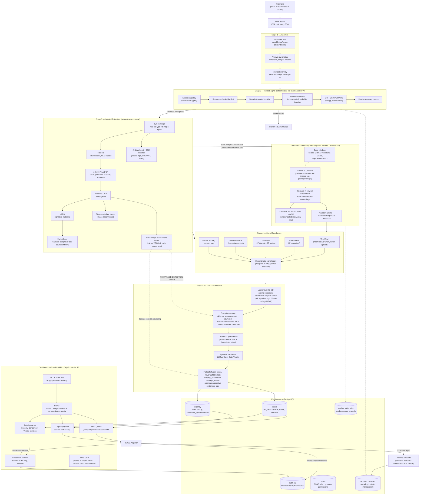

# ImaniIA — Technical Data Room

**Purpose of this document:** architecture schema, data description, technical documentation, and test plan for the *Automate Or Die* hackathon technical submission (section 02 — Data room, côté technique).

**Note on the architecture template:** this document wasn't built against the grading template file directly (not available in this workspace) — it's organized around the four requested headings (architecture schema, data description, technical documentation, test plan) and errs on the side of over-including detail rather than guessing at a specific template's exact section order.

---

## 1. Architecture — schéma détaillé

### 1.1 Full system graph

Every component in the running system — not just the five headline pipeline stages. Read top to bottom; the dashed boxes on the sides are cross-cutting concerns (auth, persistence, external services) rather than steps in the linear flow.

### 1.2 Layer-by-layer: what it does, why we built it this way, what we rejected

For every layer below, the *why not* column is a real decision we made, not a strawman — each alternative was genuinely viable and rejected for a stated reason. **The recurring thread across nearly every choice is deployment-cost minimization**: this is designed to run entirely on one on-premises workstation with zero mandatory recurring cloud spend, because a claims-intake security layer that itself becomes a line item scaling with claim volume defeats its own value proposition.

| Layer | What it does | Why this choice | Why not the alternative |
|---|---|---|---|
| **Ingestion** | Parses raw `.eml` via `email.BytesParser`, archives the original, computes a composite idempotency key (SHA-256 of raw bytes + Message-ID) | Standard library `email` module — zero dependency cost, battle-tested MIME handling | A managed email-ingestion SaaS (e.g. a parsing API) bills per message and requires sending claim content off-premises — both violate the cost and data-residency goals simultaneously |
| **Rules Engine** | Deterministic checks (blocklist, extension policy, SPF/DKIM/DMARC, dnstwist lookalikes) that the LLM can never override | Pure Python + local libraries (`dkimpy`, `checkdmarc`); dnstwist watchlist is **precomputed**, not queried live per email | A live typosquat-detection API per email would multiply linearly with volume; precomputing the watchlist turns a per-email API cost into a one-time batch job |
| **Isolated Extraction** | `python-magic`, `oletools`, `pdfid`, `PyMuPDF`, Tesseract OCR, YARA, MarkItDown, plus stego/archive-bomb/DDE checks and the CV damage model, each optionally sandboxed in a `--network=none` Docker container | All open-source, all CPU-only, all run on the same box as everything else — no per-document processing fee | Commercial document-intelligence APIs (e.g. cloud OCR/extraction services) charge per page/document and require uploading claim documents to a third party; at "120 claims/day" scale that's a recurring bill for something these libraries do for free, locally |
| **CV damage assessment** | Self-trained YOLOv8 model detects/classifies vehicle damage from claim photos; runs as an extraction-stage tool exactly like OCR/YARA | One-time training cost, then **zero marginal cost per photo**, CPU-inferenceable at this model size, keeps photos on-premises | A cloud vision API (Google Vision, AWS Rekognition, Azure CV) bills per image call indefinitely — at volume, a self-trained model amortizes to near-zero while a metered API never does. Training our own model also means it's tuned to *our* damage taxonomy instead of a generic object-detection label set |
| **Sandbox Detonation** | CAPEv2 in an isolated VM, memory-gated (drains Ollama/Docker first so it never competes with the rest of the pipeline for RAM on one machine), triggered only when static analysis + LLM confidence are both inconclusive — not on every attachment | Self-hosted, one-time VM setup, and **conditional** triggering (not "sandbox everything") keeps the expensive step rare | Commercial detonation-as-a-service (Joe Sandbox, Hybrid Analysis paid tiers, ANY.RUN) charges per submission or requires an enterprise contract; running every attachment through a paid sandbox at volume is exactly the kind of linear cost this architecture is designed to avoid. Also: uploading claim attachments to a third-party sandbox is a data-residency problem, same as extraction |
| **Signal Enrichment** | VirusTotal (hash only), AbuseIPDB, ThreatFox, AlienVault OTX, whoisit RDAP — metadata-only lookups feeding a deterministic weighted score | Free tiers of these specific APIs comfortably cover metadata-only lookups (hash/IP/domain, never file content) at this volume | Premium/enterprise threat-intel subscriptions (which bundle far more than we need) start at real recurring cost; we only need existence/reputation checks on hashes and IPs, which the free tiers already provide |
| **Local LLM Analysis** | Ollama running `gemma3:4b` (vision-capable), fed the claim text + deterministic signals + CV detection context + the raw photo, validated through Pydantic (`LLMVerdict` + `ClaimVerdict`) | **Zero marginal cost per claim** — no per-token billing at all — plus no claim content ever leaves the machine. CPU inference is viable at the target volume (see §4 test plan for measured latency) | A hosted LLM API (OpenAI, Anthropic, etc.) bills per token and scales cost linearly with claim volume — the exact opposite of the goal. It would also mean every claimant's medical record, ID copy, or police report leaves the premises, which most insurers' data-governance policies won't accept regardless of cost. Trade-off we accepted: a 4B local model is slower (minutes, not seconds) and less capable than a frontier hosted model — mitigated by never trusting it alone: the deterministic signal score bounds its risk score, and code (not the model) computes `missing_information`/`damage_source`/the settlement gate |
| **Prompt-injection guard** | Llama Guard 3 (1B) screens the claim text before the main LLM call; treated as a *soft* signal (flags force escalation post-verdict rather than pre-blocking) because it has a measured ~25% false-positive rate on legitimate HTML content | Small (1B) local model, same zero-marginal-cost logic as the main LLM | A larger/hosted guard model would be more accurate but reintroduces per-call cost and content egress for a secondary check — not worth it given the primary LLM and rules engine already bound the blast radius of a missed injection |
| **Persistence** | PostgreSQL, self-hosted, `SQLAlchemy` ORM, tables auto-created via `Base.metadata.create_all()` — no migration framework overhead for a single-node deployment | No managed-database monthly fee, full control, appropriate for current single-node scale | A managed DB service (RDS, Cloud SQL, Supabase) adds a recurring bill and, for most tiers, sends data through the provider's infrastructure — again in tension with both the cost and residency goals. We'd revisit this the moment multi-region HA is actually needed, which isn't yet |
| **Dashboard / API** | FastAPI + server-rendered Jinja2 + vanilla JS (CSP-strict, no inline handlers, delegated event handling) — one deployable process, no separate frontend build | No separate frontend hosting/CDN bill, no separate build pipeline, smaller operational surface (one process to run and monitor instead of two) | A React/Vue SPA + separate API would need its own hosting (even static hosting has a cost floor at scale) and a JS build toolchain to maintain — unjustified complexity for a dashboard that's fundamentally CRUD + review workflows, not a rich interactive app |
| **Auth** | JWT + TOTP 2FA, bcrypt password hashing, homegrown RBAC with a granular per-permission catalog (`ALL_PERMISSIONS`) | No per-monthly-active-user billing | Auth-as-a-service platforms (Auth0, Okta, Clerk) typically price per MAU — fine at seed stage, not fine once you're onboarding an insurer's full adjuster team. The auth surface here (login, 2FA, roles) is small enough that "not paying per user forever" outweighs "not maintaining 200 lines of auth code" |
| **Human Review layer** | Every rejection *and* every settlement recommendation (assistive or automated) requires an explicit adjuster click before it's considered final; audited via `audit_log` | This isn't a cost-driven choice — it's the core compliance/trust requirement the whole system exists to serve. Automating claims intake without a human sign-off on payouts is a liability, not a feature | N/A — a "fully autonomous settlement" mode was never on the table; it's explicitly out of scope regardless of confidence level |

---

## 2. Description des données

### 2.1 Sources

| Source | What arrives | Trust level |
|---|---|---|
| IMAP inbox (claim intake) | Raw email (headers, body text, attachments) | Untrusted — attacker-controlled input, treated as hostile until proven otherwise (CLAUDE.md rule: "file names are hostile," "declared file type lies") |
| Claim attachments | PDF (police reports, invoices), DOCX/XLSX (Office documents), images (damage photos) | Untrusted, isolated extraction only |
| Threat-intel APIs (Stage 4) | Metadata-only responses (reputation scores, IOC matches) | Semi-trusted, read-only, never influences extraction itself |
| CAPEv2 sandbox | Behavioral report (malscore, dropped files, network calls) | Generated in an isolated environment, treated as a signal not a verdict |

### 2.2 Format

- **Inbound**: raw MIME (`.eml`), parsed via `email.parser.BytesParser(policy=policy.default)` into a structured dict (`headers`, `body_text`, `attachments[]`, each attachment carrying `stored_path`, `original_name`, `declared_type`, `real_type` from magic-byte detection, `type_mismatch`, `sha256`).
- **Intermediate**: per-attachment extraction result dict (`tools_run[]`, `flags[]`, `extracted_text`, `iocs`, `cv_damage_assessment`, `suspicious`, `escalate`).
- **Outbound (LLM verdict)**: strict Pydantic-validated JSON — `LLMVerdict` (security concerns: `sender_risk`, `intent_classification`, `social_engineering_indicators`, `risk_score`, `confidence`, `verdict`, `reasons`) nesting a `ClaimVerdict` (claim intake fields, damage assessment, `urgency`, `settlement_recommendation`, plus code-computed `missing_information`/`damage_source`/`settlement_type`).
- **At rest**: PostgreSQL, `JSONB` columns for verdict/enrichment payloads (queryable without a rigid schema per field), typed columns for everything queried/sorted/filtered (status, urgency level/priority, timestamps).

### 2.3 Volume (target scale)

Sized against a real reference point: a mid-size institution's claims-relevant inbox processes on the order of **~120 messages/day** (≈1 every 6 minutes on average, per internal benchmarking notes). At that volume:

- CPU-only LLM inference at 3–4 minutes per claim (gemma3:4b, unaccelerated) keeps up comfortably within the arrival rate — see §4 for the measured single-claim latency breakdown.
- Sandbox detonation is conditional (inconclusive-static-analysis-only), so realistic sandbox load is a small fraction of total volume, not 120/day.
- This is explicitly a **single-node, vertically-scaled** design point. If claim volume grew by an order of magnitude, the first bottleneck would be LLM throughput, and the mitigation is a bigger/GPU'd local box before it's "add a paid API" — consistent with the cost-minimization thread throughout.

### 2.4 Prétraitement

The isolated extraction stage *is* the preprocessing layer: real file-type detection (never trust the declared MIME type or extension), OCR for image-embedded text, macro/OLE extraction for Office documents, PDF structure/link analysis, archive-bomb and DDE-field detection, stego-metadata screening on images, and the CV damage model on photos. Every step is defensive (try/except per field, per CLAUDE.md rule: "an unparseable email is suspicious, not broken — escalate it") and every step's output becomes *context*, not a trusted conclusion — the deterministic signal score and the LLM both read this context, but the LLM's own verdict is bounded by it (it can raise its risk score above what the deterministic layer computed, never silently override a rules-engine rejection or contradict a grounded CV detection without reason).

---

## 3. Documentation technique

### 3.1 Stack, with pinned versions

| Component | Package | Version |
|---|---|---|
| Web framework | fastapi | 0.137.2 |
| ASGI server | uvicorn | 0.49.0 |
| Schemas | pydantic | 2.13.4 |
| Config | python-dotenv | 1.2.2 |
| HTTP client | requests | 2.34.2 |
| Templating | Jinja2 | 3.1.6 |
| WS client (VNC relay) | websockets | 12.0 |
| Database driver | psycopg2-binary | 2.9.12 |
| ORM | SQLAlchemy | 2.0.41 |
| Rate limiting | slowapi | 0.1.9 |
| Password hashing | bcrypt | 5.0.0 |
| JWT | PyJWT | 2.13.0 |
| TOTP | pyotp | 2.10.0 |
| Crypto (vault) | cryptography | 46.0.7 |
| Metrics | prometheus-client | 0.22.1 |
| Scheduling | APScheduler | 3.11.0 |
| Email auth | dkimpy | 1.1.8 |
| Email auth | checkdmarc | 5.17.1 |
| Office inspection | oletools | 0.60.2 |
| PDF inspection | pdfid, pymupdf | — / 1.27.2.3 |
| OCR | pytesseract | 0.3.13 |
| Imaging | Pillow | 12.2.0 |
| Signatures | yara-python | 4.5.4 |
| IOC extraction | ioc-finder | 9.4.1 |
| Text extraction | markitdown | git (Microsoft, main) |
| Threat intel | OTXv2, whoisit, dnstwist[full] | latest / latest / latest |
| LLM runtime | ollama (client) | latest |
| Computer vision | ultralytics | 8.3.60 |
| Prompt-injection guard | transformers, torch | 5.12.1 / 2.5.1 |

Full pinned list: `requirements.txt`. File-type detection uses `python-magic-bin` on Windows, `python-magic` elsewhere (platform-conditional in requirements).

### 3.2 Dependency rationale (beyond the layer table above)

- **SQLAlchemy 2.0** over a lighter query builder: the schema has enough relationships (Email → AuditLog, Email → Urgency, Email → PendingDetonation) that an ORM's relationship management pays for itself versus hand-written joins, without paying for a heavier framework (e.g. Django's ORM + everything else Django brings).
- **Pydantic v2** for LLM output validation specifically because local LLM output is the least trustworthy input in the system (a small model can emit malformed JSON, out-of-range values, or hallucinated enum values) — strict validation with fail-safe defaults on every field is the difference between "escalate on bad output" and "silently accept garbage."
- **Ultralytics YOLOv8** over building a custom detection architecture from scratch: mature, well-documented, CPU-inferenceable at small model sizes, and the training/fine-tuning workflow is well-trodden — building a bespoke architecture would cost far more engineering time than it would save in inference cost.
- **`ollama` client + raw HTTP fallback** (`_call_ollama_client` → `_call_ollama_http`): defensive redundancy against the Python client library's API surface changing between versions, without hard-depending on it.

### 3.3 Deployment / infrastructure requirements

- One workstation-class machine (CPU-only is sufficient; a GPU accelerates but isn't required), 16 GB RAM class, running Windows or Linux.
- PostgreSQL 14+, local or same-LAN.
- Docker (optional) for per-tool isolated extraction containers; automatic fallback to local execution if unavailable.
- A second machine/VM for the CAPEv2 sandbox (deliberately isolated from the main host — this is the one component that *should* be physically/logically separate, for containment, not cost, reasons).
- No GPU cluster, no managed cloud services, no CDN, no message queue service — the entire non-sandbox stack runs as one process on one box.

---

## 4. Plan de test — comment valider que chaque composant fonctionne

### 4.1 Automated test suite

`pytest -q` — 83 tests passing (1 pre-existing, environment-dependent failure tracked separately, see below), organized by the same layers as the architecture:

| Architecture layer | Test coverage |
|---|---|
| Rules Engine | `tests/test_detonation.py` (extension/detonability policy), blocklist/whitelist logic exercised via routing tests |
| Isolated Extraction | `tests/test_extraction_cv_damage.py` — CV model load/inference/fail-safe paths, mocked at the model-load boundary so tests don't require the real weights file |
| Sandbox Detonation | `tests/test_cape_dashboard.py`, `tests/test_manual_detonation.py` — wrapper client, pre-flight recovery, window try-begin race safety (16-thread barrier test), report proxy path allowlisting |
| LLM Analysis + fusion | `tests/test_analysis_claim_verdict.py` — the automated/assistive settlement gate, missing-information detection, urgency fail-safe defaulting (never silently "low"), severe-damage-never-auto-settles; `tests/test_analysis_vision.py` — image payload plumbing through both Ollama call paths |
| Persistence | `tests/test_urgency_table.py` — CRUD, priority derivation, critical-first sort order |
| API / Dashboard | `tests/test_urgency_api.py` — endpoint registration, permission gating, audit-entry writing, settlement-confirmed round-trip through `GET /api/emails/{id}` |
| Auth / CSP | `tests/test_csp_no_inline_handlers.py` — regression guard against inline-handler CSP violations |
| End-to-end | `tests/test_pipeline_e2e.py` — full pipeline against real components (the one test file that talks to a live Ollama instance) |
| Architecture smoke test | `tests/test_architecture.py` — imports and exercises every integration module together |

Run everything: `pytest -q`. Run one layer: `pytest tests/test_analysis_claim_verdict.py -v`.

**Known flake, documented not hidden:** `tests/test_architecture.py` can trigger a native `transformers`/`torch` access violation loading the real Llama-Guard-3-1B model under memory pressure — reproduced identically on a completely separate, unmodified checkout of the same codebase, confirming it's a host/library interaction issue, not a defect in this project's code. Workaround: `pytest -q --deselect tests/test_architecture.py`.

### 4.2 Manual / live verification (what automated tests can't cover)

| What | How to verify | Expected result |
|---|---|---|
| End-to-end claim intake | `python scripts/generate_sample_claims.py`, feed a sample `.eml` through `EmailIngestion.parse_email()` | Correct status, subject, body, and attachment extraction (see README §Sample data — verified working this session) |
| Dashboard boot | `python src/main.py --serve`, hit `/` and `/login` | 303 redirect unauthenticated, 200 on login page |
| DB connectivity + schema | Server startup log | `[DB] All tables created / verified.` — confirms every SQLAlchemy model (including the newest, `urgency`) resolves against the live database with zero manual migration |
| IMAP polling | Server startup log | `[POLL] Background IMAP polling started` |
| LLM reachability | `curl localhost:11434/api/tags` | Lists the configured model (`gemma3:4b`) |
| Full claim → verdict → settlement flow | Submit a claim with a photo, open its detail page, confirm both Security Concerns and Verdict sections render, confirm settlement | `settlement_confirmed` flips to `true`, audit-logged, visible on `/audit` |
| Urgency queue ordering | Insert claims at each urgency level, open `/urgency-queue` | Sorted critical → high → medium → low |
| Fail-safe behavior | Kill Ollama mid-run; submit a malformed-JSON-producing prompt; omit required claim fields | Escalation, never silent acceptance, in every case (this is asserted directly in `tests/test_analysis_claim_verdict.py` for the fail-safe paths, and was independently confirmed live this session for the Ollama-down case) |

### 4.3 Security-specific validation

- **VirusTotal usage boundary**: automated + manually reviewed — hash lookups only, file upload calls do not exist in the codebase (`src/virustotal.py` exposes hash-check only).
- **Extraction container isolation**: `sandbox.py` enforces `--network=none --read-only --cap-drop=ALL --no-new-privileges` plus CPU/memory/PID limits per tool container — verified by inspecting the container run command construction, not just trusting the flag list.
- **Public-repo secret hygiene**: manually re-verified before every push — `git grep` sweep for old branding, hardcoded-secret pattern scan (API key formats, PEM headers), and a byte-size sweep for unexpectedly large staged files, catching two real near-misses this session (the proprietary YARA ruleset and the proprietary CV model weights almost shipped publicly before a pre-push review caught both).
